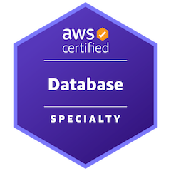
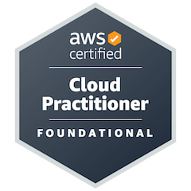
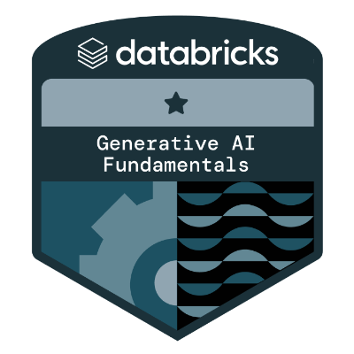
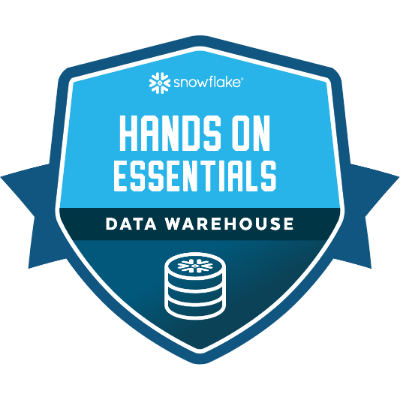
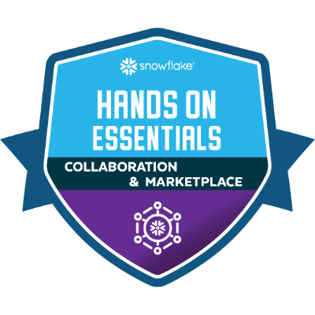
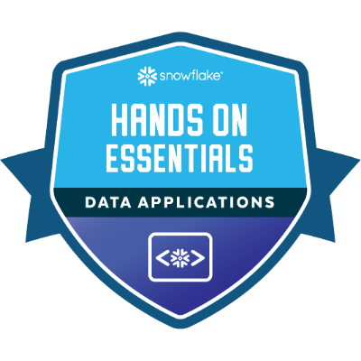

# Certifications

  
  <!-- AWS Database Specialty Certification -->
  

    <h3>AWS Database Specialty Certification</h3>
    
    

      The AWS Certified Database - Specialty exam validates expertise in recommending, designing, and maintaining the optimal AWS database solution to improve performance, reduce costs, and enable innovation.
      <a href="https://aws.amazon.com/training/classroom/exam-readiness-aws-certified-database-specialty/?nc1=h_ls" target="_blank">Learn More</a>
    

  

  <!-- AWS Certified Cloud Practitioner -->
  

    <h3>AWS Certified Cloud Practitioner</h3>
    
    

      The AWS Certified Cloud Practitioner validates foundational, high-level understanding of AWS Cloud, services, and terminology. This is a good starting point on the AWS Certification journey for individuals with no prior IT or cloud experience switching to a cloud career.
       <a href="https://aws.amazon.com/certification/certified-cloud-practitioner/" target="_blank">Learn More</a>
    

  

  <!-- Databricks- Generative AI Fundamentals -->
  

    <h3>Databricks- Generative AI Fundamentals</h3>
    
    

       Generative AI will disrupt every industry and deliver value through new use cases. Learn the basics of generative AI, including large language models (LLMs), with 4 short videos. 
       <a href="https://www.databricks.com/learn/training/generative-ai-fundamentals-accreditation#data-video" target="_blank">Learn More</a>
    

  

  
   <!-- Hands-On Essentials: Data Warehousing Workshop -->
  

    <h3>Hands-On Essentials: Data Warehousing Workshop</h3>
    
    

    Data Warehousing Workshop is designed for learners who are new to Snowflake, or new to databases in general. This workshop is highly interactive with reflection questions, hands on lab work and automated lab work checks! Fast-paced and informative, light in tone, scenario-driven and metaphor rich.
      <a href="https://learn.snowflake.com/en/courses/uni-essdww101/" target="_blank">
        Learn More
      </a>
    

  

   <!-- Hands-On Essentials: Collaboration, Marketplace & Cost Estimation Workshop -->
  

    <h3>Hands-On Essentials: Collaboration, Marketplace & Cost Estimation Workshop</h3>
    
    

    A course covering Snowflake's revolutionary collaboration technologies. Learn to create listings, get listings sent by other accounts, and shop for data sets on the Snowflake Marketplace. Understand how your organization can get rid of nightly extracts and cumbersome ETL processes. This course also helps those new to SQL brush up on some important SQL skills including basics like DISTINCT, GROUP BY, ORDER BY, JOINS, and control-of-flow like BEGIN, END, DECLARE and FOR. Finally, the course covers cost categories, cost estimation, and some beginner-level cost control mechanisms.
      <a href="https://learn.snowflake.com/en/courses/uni-ess-cmcw/" target="_blank">
        Learn More
      </a>
    

  

   <!-- Hands-On Essentials: Data Application Builders Workshop -->
  

    <h3>Hands-On Essentials: Data Application Builders Workshop</h3>
    
    

    Almost like a full-stack developer bootcamp, this course covers a wide array of technologies that will help you build applications that use Snowflake as a back end. Including: Streamlit (Python), SnowSQL, REST APIs, and much more.
      <a href="https://learn.snowflake.com/en/courses/uni-ess-dabw/" target="_blank">
        Learn More
      </a>
    

  

